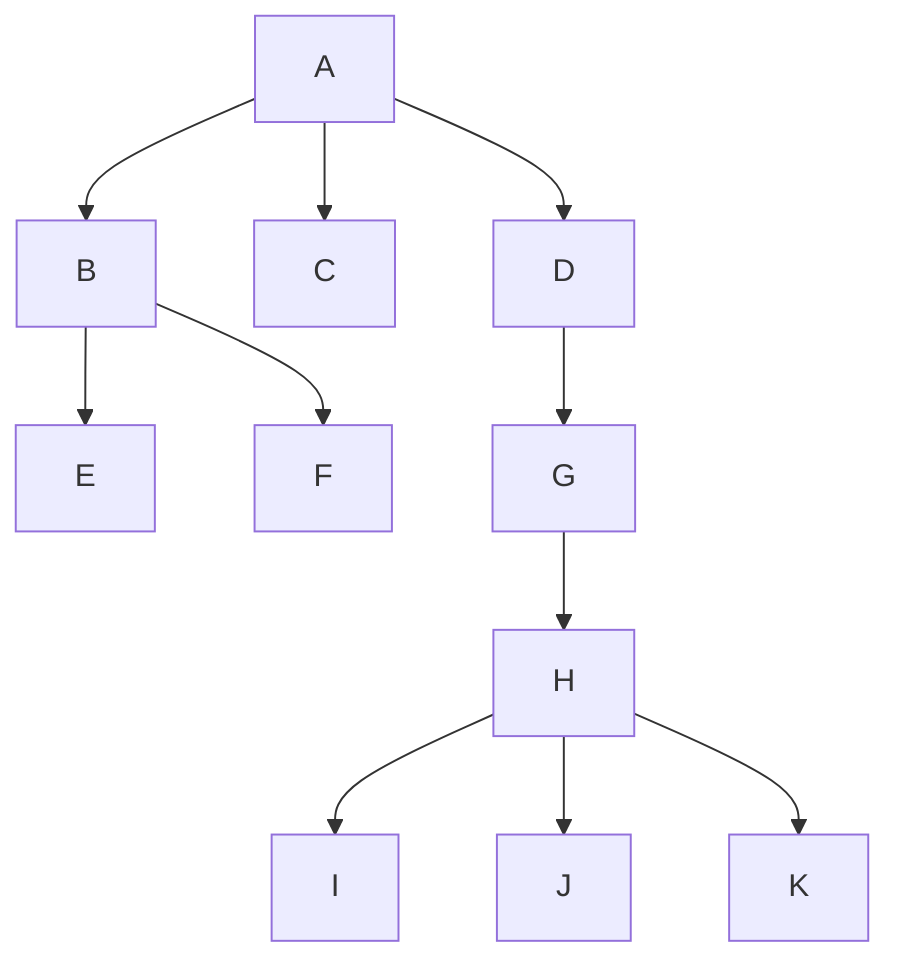

一、数组

数组是**同一数据类型**的集合，数组一旦创建，**大小不可变**；

数组所有元素初始化为默认值，整型都是`0`，浮点型是`0.0`，布尔型是`false`；

数组元素可以是值类型（如int）或引用类型（如String），但数组本身是**引用类型**；

## 统计数组中的元素

### 如何统计元素出现的次数？

```java
//定义一个数组cnt[i]表示i出现的次数；
//规定数组nums元素为1~n,即{1,2,3，...,n}
int[] cnt = new int[nums.length + 1];  //表示数组nums中有一个数字重复出现2次
for(int i = 0; i < nums.length; i++){
    //nums[i]的值每出现1次，cnt数组汇总对应的索引位置+1
	cnt[nums[i]]++;
}
```

```java
//HashMap<K,V>存储：key为元素；value为元素出现的次数
Map<Integer, Integer> hs = new HashMap<Integer,Integer>();
for(int num : nums){
	hs.put(num,hs.getOrDefault(num,0)+1);
}
```

**原地哈希**【41缺失的第一个正数】

寻找[1,...,`nums.length`]中缺失/多余的数字时。

【原地哈希】就是利用原数组完成查找；

【1】如果数组中有1，便把1放在数组第一个位置；若有2，便把2放在第二个位置，以此类推。

【2】如果是一个小于1的数字，肯定不是我们要找的数字，可直接忽视；

【3】如果是一个大于`nums.length`+1的数字，也可直接忽略。

```java
原数组[6,5,3,4,1]----遍历完成后变为----[1,?,3,4,5]
此时发现？所在的位置并不是2，
```

## 数组的改变、移动

数组的移动并不能通过一条简单语句实现，但可以通过**删除、插入**操作完成，也可通过**多次交换**完成

```java
//【取出数组nums中最小值】
int minNum = Arrays.stream(nums).min().getAsInt();
//【取出数组nums中最小值】----更优
int minNum = nums[0];
for(int num : nums){
	minNum = Math.min(num, minNum);	
}
```

【双指针】

【1】同向双指针（用此方法处理过的数组，处理好的数据的**相对位置会保持一致**）


通用步骤：

- 【1】初始化双指针，`i=0, j=0`;

- 【2】`while (j < nums.length)`
  - 如果`nums[j]`是我们需要保留的,就用`nums[i]=nums[j]`，`i++`为存储下一个待保留的数做准备；
  - 否则跳过。`j++`.

【2】反向双指针（用此方法处理过的数组**不会保留原来元素的相对位置**）


通用步骤：

- 【1】初始化双指针：`i=0,j=n-1`;
- 【2】`while(i<=j)`
  - 基于`nums[i]和nums[j]`的值，决定你下一步该如何操作；
  - 至少移动一个指针。


## 二维数组及滚动数组

- 有时候，二维数组的某些元素并不是在整个运算过程中都用的到，**可能只需要用到前一个或前两个一维数组**，此时，可以用到**滚动数组**的思想优化空间复杂度。

  - 【滚动数组】是动态规划中的一种编程思想。简单的理解就是让数组滚动起来，每次使用固定的几个存储空间，来达到压缩，节省存储空间的作用。起到**优化空间**，主要应用在递推或动态规划中。因为动态规划题目是一个自低向上的扩展过程，常常需要用到的是连续的解，前面的解往往可以舍去。所以滚动数组优化是很有效的。

  - 【二维数组举例】

    ```java
    int i, j, d[100][100];
    for(i = 0; i < 100; i++){
    	for(j = 0; j < 100; j++){
        	d[i][j] = d[i - 1][j] + d[i][j - 1];
        }
    }
    //d[i][j]只依赖于 d[i-1][j]和d[i][j-1]
    ```

    
    
    ```java
    //利用滚动数组思想(上述例子涉及到2行)
    int i, j, d[2][100];
    for(i = 0; i < 100; i++){
    	for(j = 0; j < 100; j++){
        	d[i % 2][j] = d[(i - 1) % 2][j] + d[i % 2][j - 1];
        }	
    }
    ```


## JAVA运算符

- 逻辑运算符

  > `&&`    `||`    `!`

- 算术运算符

  > `+`	`-`	`*`	`/`	`+=`

- **位运算符**

  > `^`	`|`	`&`

  - `^`:**异或运算符**，1^0=1; 1^1=0; 0^0=0;
  - `|`:**按位或**，6的二进制位`0000 0110`,2的二进制位`0000 0010`,则`6|2`的二进制位为`0000 0110`=6;
  - `&`:**按位与**，运算规则是将两边的数转换为**二进制位**，然后运算最终值，1&1=1; 1&0=0
    - 计算`3&5`，3的二进制位是`0000 0011`,5的二进制位是`0000 0101`,则`011&101=001`,所以最终结果为`0000 0001`=1,即`3&5=1`;

- **其他运算符**

  > `<<`	`>>`	`~`	`>>>`

  - `<<`:**左移运算符**，
    - `5<<2`:指5的二进制位往左移动两位，右边**补0**，5的二进制位为`0000 0101`,则移位后为`0001 0100`=20,其中正数左起第一位补0，负数补1；
    - `-3<<3`:`1000 0011`---->`1001 1000`=`-24`;
  - `>>`:**右移运算符**，
    - `5<<2`:指5的二进制位往右移动两位，左边**补0**，5的二进制位为`0000 0101`,则移位后为`0000 0001`=1,其中正数左起第一位补0，负数补1；
  - `~`:**取反运算符**
  - `>>>`:**无符号右移运算符**,无符号右移运算符和右移运算符的主要区别在于负数的计算。
    - `15>>>2`:`0000 1111`---->`0000 0011`=3;
    - `-6>>>3`:-6的二进制是6的二进制取反再加1（相当于补码），6的二进制位`0000 0000 0000 0000 0000 0000 0000 0110`,去反加1为`1111 1111 1111 1111 1111 1111 1111 1010`,右移三位`0001 1111 1111 1111  1111 1111 1111 1111`=536870911


# 二、字符串

## 【1】数字、字符、字符串相互转换

【1】数字、字符串相互转换

```java
// 把任意基本类型或引用类型转换为字符串，可使用静态方法valueOf()
int num = 5;
String str = String.valueOf(num);
// 把字符串转换为其他类型（需根据情况而定），如把字符串转换为`int`类型：
int n1 = Integer.parseInt("123");  // 123
int n2 = Integer.parseInt("ff",16);  // 按16进制转换，255
```

【2】字符、字符串相互转换

```java
// 字符转字符串
char ch = '5';
String str = String.valueOf(ch);
// 字符串转字符
String str = "123";
char ch = str.charAt(0);  // 获得字符'1'--方法charAt(int index)返回指定索引处的 char值。 
```

【3】数字、字符互相转换

```java
// 数字转字符（不能直接转换，需要先借助数字转字符串）
int num = 5;
String temp = String.valueOf(num);
char ch = temp.charAt(0);
// String的toCharArray()方法:将此字符串转换为新的字符数组
char[] cs = "Hello".toCharArray();  //String -> char[]

```

## 【2】整数反转

输入123，输出321；

- 记rev为反转后的数字，思路：重复【弹出】x的末尾数字，将其【推入】rev的末尾；直至x为0；

- ```java
  //弹出x的末尾数字digit
  digit = x % 10
  x = x / 10
  //将数字digit推入rev末尾
  rev = rev * 10 + di
  ```

## 【3】ASCII码

- `'a'`对应的ASCII值为97；`'z'`对应的ASCII值为122；

- `'A'`对应的ASCII值为65；`'Z'`对应的ASCII值为90；

- ```java
  // s为小写字母a~z组成的字符串
  for(int i = 0; i < s.length(); i++){
  	s.charAt(i)-'a';     //此处-'a'的作用就是将a~z的下标转换成0~25;
  }
  ```

## [4]判断字符是否为字母

```java
//Character包含判断字符是否为字母的方法
isLetter();
//确定指定的字符是否为字母或数字。 
isLetterOrDigit();
//使用UnicodeData文件中的大小写映射信息将字符参数转换为小写。
toLowerCase();
```

## 【5】判断数值是否溢出

- 判断数字是否超过32位有符号整数的范围[$-2^{31}$，$2^{31}-1$]
- 等价条件：判断不等式[$-2^{31}/10$] ≤ rev ≤ [$(2^{31}-1)/10$]是否成立；

## 【6】字符串匹配

- 常见的字符串匹配算法包括：暴力匹配、`Knuth-Morris-Pratt算法`、`Boyer-Moore 算法`、`Sunday 算法`等
- 在字符串haystack中找字符串needle，字符串长度分别为n、m;

- 【暴力匹配】

  - 思路：让字符串needle与字符串haystack的所有长度为m的子串匹配一次。为减少不必要的匹配，每次匹配失败即立刻停止当前子串的匹配，对下一个子串继续匹配。若当前子串匹配成功，返回当前子串的开始位置即可。若所有子串都匹配失败，则返回-1。

    ```java
    class Solution {
        public int strStr(String haystack, String needle) {
            int n = haystack.length(), m = needle.length();
            for (int i = 0; i + m <= n; i++) {
                boolean flag = true;
                for (int j = 0; j < m; j++) {
                    if (haystack.charAt(i + j) != needle.charAt(j)) {
                        flag = false;
                        break;
                    }
                }
                if (flag) {
                    return i;
                }
            }
            return -1;
        }
    }
    ```

- 【`KMP`算法】

  - T : `[a,b,a,a,c,a,b,a,b,c,a,c]`

    P :`[a,b,a,b,c]`

  - 【1】找出P的`前缀表`:

    a

    a,b

    a,b,a

    a,b,a,b

    a,b,a,b,c

  - 【2】将找出的每个前缀当做独立的字符串，对于每个字符串分别找出它的最长公共前后缀；

    例如：对于[a,b,a,b],若取前、后缀长度均为3时，前缀为：`aba`,后缀为：`bab`,显然不一样；当取前后缀长度为2时，前缀：`ab`,后缀：`ab`,显然一样，所以对于[a,b,a,b]则其最长公共前后缀长度为2。所以：

    a----0

    a,b----0

    a,b,a----1

    a,b,a,b----2

    a,b,a,b,c----0

    形成公共最长前后缀列表prefix table[0,0,1,2,0],若KMP算法要写成**以0为下标的数组**,一般将最后一段删除（a,b,a,b,c----0），并在最前端补上-1；形成**prefix table[-1,0,0,1,2]**。

    | a    | b    | a    | b    | c    |
    | ---- | ---- | ---- | ---- | ---- |
    | -1   | 0    | 0    | 1    | 2    |

    【第一次匹配】到$b^3_1$时匹配失败，此时b对应的前缀表数字为1，则将出现错误时位置a对齐P中下标为1的地方，即$b^1_0$;

    

    【第二次匹配】a和即$b^1_0$任然匹配失败，则将出现错误时位置a对齐P中下标为0的地方，即$a^0_1$;

    

    【第三次匹配】T中a和$a^0_1$匹配成功，c与$b^1_0$匹配失败，将出现错误时位置c对齐P中下标为-1的地方(可看作是P中第一个a前面的一个位置)

    

    【第四次匹配】匹配成功

    

## 【7】StringBuilder

`StringBuilder`是一个可变的字符串类，可预分配缓冲区，可将其看作是一个容器，**可变**指的是`StringBuilder`对象中的内容是可变的。

```java
StringBuilder sb = new StringBuilder();
for(int i = 0; i < 100; i++){
	sb.append(',');
	sb.append('i');
}
String s = sb.toString();
```

`StringBuilder`的主要操作为`append`和`insert`方法：

- `append(任意类型)`：始终在构建器的尾端添加字符
- `insert`在指定点添加字符；

`StringBuilder`与`String`相互转换：

- `toString()`：把`StringBuilder`转换为`String`;
- 通过构造方法可以实现把`String`转换为`StringBuilder`, 即`StringBuilder(String s)`;

## 【8】String常用方法

- `indexOf()`    返回指定字符第一次出现的字符串中的索引。 
- `substring(int beginIndex, int endIndex)`    返回一个字符串，该字符串是此字符串的子字符串。

# 三、链表

`java ListNode`链表是用JAVA**自定义实现**的链表结构：

**基本结构**：

```java
class ListNode{    // 类名：Java类就是一种自定义的数据结构
    int val;       // 数据：节点数据
    ListNode next; // 对象：引用下一个节点对象。在Java中没有指针的概念，Java中的引用和C语言的指针类似
}
```

**添加构造方法方便初始化**：

```java
class ListNode {        //类名 ：Java类就是一种自定义的数据结构
    int val;            //数据 ：节点数据 
    ListNode next;      //对象 ：引用下一个节点对象。在Java中没有指针的概念，Java中的引用和C语言的指针类似
    
    ListNode(int val){  //构造方法 ：构造方法和类名相同   
        this.val=val;     //把接收的参数赋值给当前类的val变量
    }
}
```

**创建链表及遍历链表**：

```java
class ListNode {        //类名 ：Java类就是一种自定义的数据结构
    int val;            //数据 ：节点数据 
    ListNode next;      //对象 ：引用下一个节点对象。在Java中没有指针的概念，Java中的引用和C语言的指针类似
    
    ListNode(int val){  //构造方法 ：构造方法和类名相同   
        this.val=val;   //把接收的参数赋值给当前类的val变量
    }
}

class Test{
    public static void main(String[] args){
        
        ListNode nodeSta = new ListNode(0);    //创建首节点
        ListNode nextNode;                     //声明一个变量用来在移动过程中指向当前节点
        nextNode=nodeSta;                      //指向首节点

        //创建链表
        for(int i=1;i<10;i++){
            ListNode node = new ListNode(i);  //生成新的节点
            nextNode.next=node;               //把新节点连起来
            nextNode=nextNode.next;           //当前节点往后移动
        } //当for循环完成之后 nextNode指向最后一个节点，
        
        nextNode=nodeSta;                     //重新赋值让它指向首节点
        print(nextNode);                      //打印输出
      
    }
    
    //打印输出方法
    static void print(ListNode listNoed){
        //创建链表节点
        while(listNoed!=null){
            System.out.println("节点:"+listNoed.val);
            listNoed=listNoed.next;
        }
        System.out.println();
    }
   
}
```

## 【1】计算链表长度

```java
public int getLength(ListNode head){
	int length = 0;
    while(head != null){
    	length++;
        head = head.next;
    }
    return length;
}
```

## 【2】哑节点(dummy node)

在链表操作中，添加一个`哑节点`,让它的指针指向链表的头节点。

```java
ListNode dummy = new ListNode(val, head);
```

**好处**：

- 省略头节点为空时的情况判断；
- 头节点和其他节点进行同样的操作时，由于头节点没有前一个节点，需要对这种情况进行单独判断，但加入哑节点后，头节点可以当作普通节点看待；

## 【3】链表反转

- 利用**栈**：先入后出

  ```java
  // 先将原链表全部入栈；再一个个出栈，出栈的时候把出栈的节点串成一个新的链表；
  public ListNode reverseList(ListNode head){
      Stack<ListNode> stack = new Stack<ListNode>();
      // 将链表节点推入栈中
      while(head != null){
      	stack.push(head);
          head = head.next;
      }
      if(stack.empty()){
      	return null;
      }
      ListNode node = stack.pop();
      ListNode dummy = node;
      // 将栈中的节点全部出栈，并重新连成一个新链表
      while(!stack.empty()){
      	ListNode temp = stack.pop();
          node.next = temp;
          node = node.next;
      }
      node.next = null;
      return dummy;
  }
  ```
  

## 【4】合并有序链表（21）

【思路】利用**递归**，定义两个链表的合并操作（忽略边界情况，比如空链表等）：

- 【1】`list1[0]`+`merge(list1[1:],list2)`      `list1[0] < list2[0]`
- 【2】`list2[0]`+`merge(list1,list2[1:])`     `otherwise`

即两个链表头部值较小的那个节点与剩下元素的`merge`操作结果合并。

```java
/**
 * Definition for singly-linked list.
 * public class ListNode {
 *     int val;
 *     ListNode next;
 *     ListNode() {}
 *     ListNode(int val) { this.val = val; }
 *     ListNode(int val, ListNode next) { this.val = val; this.next = next; }
 * }
 */
class Solution {
    public ListNode mergeTwoLists(ListNode list1, ListNode list2) {
        // 边界情况
        if(list1 == null){
        	return list2;
        }else if(list2 == null){
        	return list1;
        }
        if(list1.val < list2.val){
        	list1.next = mergeTwoLists(list1.next,list2);
            return list1;
        }else{
        	list2.next = mergeTwoLists(list1,list2.next);
            return list2;
        }
    }
}
```

## 【5】环形链表

- 判断**链表是否有环**：【快慢指针】**慢指针针每次走一步，快指针每次走两步**，如果相遇就说明有环，如果有一个为空说明没有环。
  - 为什么快慢指针就一定能判断是否有环。**假如有环，那么快慢指针最终都会走到环上，快指针每次走两步，慢指针每次走一步，所以每走一次快慢指针的间距就要缩小一步**。


# 四、树

树比链表稍微复杂，因为链表是线性数据结构，而树不是。 树的问题可以由 `广度优先搜索` 或 `深度优先搜索` 解决。

-  **广度优先搜索（BFS - Breadth First Search）**：优先从离起点近的顶点开始搜索，由近及远进行广泛的搜索。因此，目标顶点离起点越近，搜索结束得越快。（**队列**结构存储，先入先出）
-  **深度优先搜索（DFS - Depth First Search）**：沿着一条路径不断往下搜索直到不能再继续为止，然后再折返，开始搜索下一条候补路径。（候补节点用**栈**存储，先入后出）
   -  **DFS**思路：
      -  1.创建结构存储变量，初始化当前结果；
      -  2.设计递归函数；
         -  函数执行过程：
            -  若到达结尾，则返回；
            -  若未到达结尾，则更新当前结果；
            -  若到达末尾叶子结点，进行最优结果更新；
            -  分别对当前结点的左/右叶子结点调用递归函数；

      -  3.开始调用递归函数。


-  虽然广度优先搜索和深度优先搜索在搜索顺序上有很大的差异，但是在操作步骤上却只有一点不同，即**选择哪一个候补顶点作为下一个顶点的基准不同**，广度优先搜索选择的是**最早成为候补的顶点**，因为顶点离起点越近就越早成为候补，所以会从离起点近的地方开始按顺序搜索；而深度搜索选择则是**最新成为候补的顶点**，所以会一路往下，沿着新发现的路径不断深入搜索。

【树的遍历】按某种方式访问树中的每一个结点且每一个结点只被访问一次。

- **先根遍历**：若树不空，则先访问根节点，然后依次先根遍历各棵子树；
  - A-B-E-F-C-D-G-H-I-J-K
- **后根遍历**：若树不空，则先依次后根遍历各棵子树，然后访问根节点；
  - E-F-B-C-I-J-K-H-G-D-A
- **层次遍历**：若树不空，则自上而下自左至右访问树中每个结点；
  - A-B-E-F-C-D-G-H-I-J-K



【二叉树】二叉树不是树；

- 二叉树可以为空，树不行；

- 二叉树严格区分左右子树，树不区分子树的左右顺序；

- 二叉树的存储结构：

  - 【1】**顺序存储结构**：增添空结点补齐为一颗完全二叉树，并对所有结点进行编号；

    - 优点：完全二叉树或满二叉树采用顺序存储结构比较适合；
    - 缺点：如果需要增加很多空结点才能将一颗二叉树改造成为一颗完全二叉树，采用顺序存储结构会造成空间的大量浪费，这时不宜采用顺序存储结构。

  - 【2】**链式存储结构**：每个结点有三个域组成，一个值域存放值，两个引用域分别指向左子树和右子树。

    - ```java
      public class BTNode<E>{	// 二叉链中结点类
      	E data;		    // 存放数据元素
          BTNode lchild;  // 指向左孩子结点
          BTNode rchild;  // 指向右孩子结点
          
          public BTNode(){	// 默认构造方法
          	lchild = rchild = null;
          }
          public BTNode(E d){	// 重载构造方法
          	data = d;
              lchild = rchild = null;
          }
      }
      ```

    - ```java
      // 创建一颗二叉树
      public class BTree{
      	BTNode<Character> root;	// 创建根结点
          
          BTree(){
          	root = null;
          }
      }
      ```

- **二叉树的深度优先遍历**：

  - 前序遍历
  - 中序遍历
  - 后序遍历

- **二叉树的广度优先遍历**：

  - 层序遍历

- ****

- **前序遍历**：

  - 访问顺序：根节点-->左子树-->右子树
  - 前序遍历的结果：A→B→D→E→C→F

  ```java
  // 递归
  public List<Integer> preOrderTraversal(TreeNode root){
      // [1]退出条件
      if(root == null){
      	return null;
      }
      // [2]单层逻辑
      // 访问根节点
      // 访问左节点
      // 访问右节点
      Sytem.out.print(root.val);
      preOrderTraversal(root.left);
      preOrderTraversal(root.right);
      // [3]传递参数
      // 传入参数为root根节点，输出参数为该根节点的访问路径
      return null;
  }
  // 非递归
  class Solution {
      public List<Integer> preorderTraversal(TreeNode root) {
          List<Integer> res = new ArrayList<Integer>();
          if (root == null) {
              return res;
          }
  
          Deque<TreeNode> stack = new LinkedList<TreeNode>();
          TreeNode node = root;
          while (!stack.isEmpty() || node != null) {
              while (node != null) {
                  res.add(node.val);
                  stack.push(node);
                  node = node.left;
              }
              node = stack.pop();
              node = node.right;
          }
          return res;
      }
  }
  ```

  

- **中序遍历**

  - 访问顺序：左子树→根节点→右子树
  - 中序遍历的结果：D→B→E→A→F→C

  ```java
  public static void inOrderTraversal(TreeNode node){
  	if(node == null) return;
      inOrderTraversal(node.left);
      System.out.println(node.val);
      inOrderTraversal(node.right);
  }
  // 非递归的写法
  class Solution {
      public List<Integer> inorderTraversal(TreeNode root) {
          List<Integer> res = new ArrayList<Integer>();
          if(root == null){
              return res;
          }
          Deque<TreeNode> stack = new LinkedList<TreeNode>();
          // 只要存储节点的栈不为空||root!=null
          while(!stack.isEmpty() || root != null){
              while(root != null){
                  stack.push(root);
                  root = root.left;
              }
              root = stack.pop();
              res.add(root.val);
              root = root.right;
          }
          return res;
      }
  }
  ```

- **后序遍历**

  - 访问顺序：左子树→右子树→根节点
  - 后序遍历的结果：D→E→B→F→C→A

  ```java
  class Solution{
      public List<Integer> method1(TreeNode root) {
          List<Integer> ans=new LinkedList<>();
          Stack<TreeNode> stack=new Stack<>();
          TreeNode prev=null;
          //主要思想：
          //由于在某颗子树访问完成以后，接着就要回溯到其父节点去
          //因此可以用prev来记录访问历史，在回溯到父节点时，可以由此来判断，上一个访问的节点是否为右子树
          while(root!=null||!stack.isEmpty()){
              while(root!=null){
                  stack.push(root);
                  root=root.left;
              }
              //从栈中弹出的元素，左子树一定是访问完了的
              root=stack.pop();
              //现在需要确定的是是否有右子树，或者右子树是否访问过
              //如果没有右子树，或者右子树访问完了，也就是上一个访问的节点是右子节点时
              //说明可以访问当前节点
              if(root.right==null||prev==root.right){
                  ans.add(root.val);
                  //更新历史访问记录，这样回溯的时候父节点可以由此判断右子树是否访问完成
                  prev=root;
                  root=null;
              }else{
              //如果右子树没有被访问，那么将当前节点压栈，访问右子树
                  stack.push(root);
                  root=root.right;
              }
          }
          return ans;
      }
  }
  ```

- **层序遍历**

  ```java
  // 非递归的写法
  class Solution {
      public List<Integer> levelOrder(TreeNode root) {
          List<Integer> res = new ArrayList<Integer>();
          if(root == null){
              return res;
          }
          Queue<TreeNode> queue = new LinkedList<TreeNode>();
          //根节点入队
          queue.add(root);
          while(!queue.isEmpty()){
          	//根节点出队
              TreeNode node = queue.remove();
              res.add(node.val);
          	//左节点入队
              if(node.left != null){
              	queue.add(node.left);
              }
          	//右节点入队
              if(node.right != null){
              	queue.add(node.right);
              }
          }
          return res;
      }
  }
  ```

  

## 【1】二叉树的最大深度

```java
// 递归
class Solution {
    public int maxDepth(TreeNode root) {
        // 二叉树若为空，则深度为0
        if (root == null){
        	return 0;
        }
        // 左/右子树深度
        int lDepth = maxDepth(root.left);
        int rDepth = maxDepth(root.right);
        // 左右子树中大的那一个+根节点
        return Math.max(lDepth,rDepth) + 1;
    }
}
// 递归--精简版
class Solution {
    public int maxDepth(TreeNode root) {
        // 二叉树若为空，则深度为0
        return root == null ? 0 : Math.max(maxDepth(root.left), maxDepth(root.right)) + 1;
    }
}
```

```java
// 深度优先搜索（栈-后序遍历）
class Solution {
    public int maxDepth(TreeNode root) {
        
    }
}
```

```java
// 广度优先搜索（队列存储）
class Solution {
    public int maxDepth(TreeNode root) {
        Queue<TreeNode> queue = new ArrayDeque<>();
        if(root == null) queue.add(root);
        int count = 0;
        while(!queue.isEmpty()){
        	int n = queue.size();
            List<Integer> level = new ArrayList<>();
            for(int i = 0; i < n; i++){
            	TreeNode node = queue.poll();
                level.add(node.val);
                if(node.left != null){
                	queue.add(node.left);
                }
                if(node.right != null){
                    queue.add(node.right);
                }
            }
            count++;
        }
        return count;
    }
}
```

## 【2】验证二叉搜索树

```java
// 递归
class Solution {
    public boolean isValidBST(TreeNode root) {
        return isValidBST(root, Long.MIN_VALUE, Long.MAX_VALUE);
    }
    
    public boolean isValidBST(TreeNode root, long minVal, long maxVal) {
        if (root == null)
            return true;
        //每个节点如果超过这个范围，直接返回false
        if (root.val >= maxVal || root.val <= minVal)
            return false;
        //这里再分别以左右两个子节点分别判断，
        //左子树范围的最小值是minVal，最大值是当前节点的值，也就是root的值，因为左子树的值要比当前节点小
        //右子数范围的最大值是maxVal，最小值是当前节点的值，也就是root的值，因为右子树的值要比当前节点大
        return isValidBST(root.left, minVal, root.val) && isValidBST(root.right, root.val, maxVal);
    }
}
```

```java
// 中序遍历
class Solution {
    public boolean isValidBST(TreeNode root) {
        Deque<TreeNode> stack = new LinkedList<TreeNode>();
        double inorder = -Double.MAX_VALUE;

        while (!stack.isEmpty() || root != null) {
            while (root != null) {
                stack.push(root);
                root = root.left;
            }
            root = stack.pop();
              // 如果中序遍历得到的节点的值小于等于前一个 inorder，说明不是二叉搜索树
            if (root.val <= inorder) {
                return false;
            }
            inorder = root.val;
            root = root.right;
        }
        return true;
    }
}
```


# 五、排序和搜索

## 二分查找

```java
left + (right - left) /2  是最常用的

int mid = (left + right)/2; //这种写法会存在溢出问题
int最大2^31-1,若left=1，right=2^31-1，则left+right>最大值，溢出。
```


# 六、动态规划

- 动态规划步骤：

  - [1]DP数组的含义

  - [2]递推公式

  - [3]DP数组初始化

  - [4]DP数组遍历顺序

  - [5]打印DP数组

- 动态规划的步骤：

  - [1]确定状态
  - [2]找出转移公式
  - [3]确定初始条件及边界条件
  - [4]计算结果

## 【1】爬楼梯（70）

- 【1】DP数组的含义
  - `dp[i]`:爬到第i阶，有`dp[i]`种不同的方法；
- 【2】递推公式
  - dp[i] = dp[i-1]+dp[i-2]
- 【3】DP数组初始化
  - dp[1] = 1
  - dp[2] = 2
- 【4】DP数组遍历顺序
  - 从小到大
- 【5】打印DP数组

```java
class Solution {
    public int climbStairs(int n) {
		if(n == 1) return 1;
        if(n == 2) return 2;
        int[] dp = new int[n + 1];
        dp[1] = 1;
        dp[2] = 2;
        for(int i = 3; i <= n; i++){
        	dp[i] = dp[i - 1] + dp[i - 2];
        }
        return dp[n];
    }
}
//时间复杂度：O(n)
//空间复杂度：O(n)
```

**优化空间复杂度**：可发现，当前状态**依赖**前两个状态，所以可以做空间上的优化。

```java
class Solution {
    public int climbStairs(int n) {
		if(n == 1) return 1;
        if(n == 2) return 2;
        int[] dp = new int[3];
        dp[1] = 1;
        dp[2] = 2;
        int temp = 0;
        for(int i = 3; i <= n; i++){
        	temp = dp[1] + dp[2];
            dp[1] = dp[2];
            dp[2] = temp;
        }
        return dp[2];
    }
}
//时间复杂度：O(n)
//空间复杂度：O(1)
```

## 【2】买卖股票的最佳时机（121）

- 【1】DP数组的含义
  - `dp[i][0]`: 第i天持有股票所得最多现金；
  - `dp[i][1]`: 第i天不持有股票所得最多现金；
- 【2】递推公式
  - `dp[i][0]`: 
    - 1.第i-1天就持有股票，即保持现状，所得现金即昨天持有股票的所得现金`dp[i-1][0]`；
    - 2.第i天买入股票，所得现金即买入今天的股票后所得现金-prices[i];
    - `dp[i][0]`应该选择现金最大的，所以`dp[i][0]`=max(`dp[i - 1][0]`, -prices[i]);
  - `dp[i][1]`: 
    - 1.第i-1天就不持有股票，即保持现状，所得现金即昨天持有股票的所得现金`dp[i-1][1]`；
    - 2.第i天买出股票，所得现金即买入今天的股票后所得现金`dp[i-1][0]`+prices[i];
    - 同样`dp[i][1]`取最大的，`dp[i][1]` = max(`dp[i - 1][1]`, prices[i] + `dp[i - 1][0]`);
- 【3】DP数组初始化
  - `dp[0][0]`表示第0天持有股票，此时的持有股票就一定是买入股票了，因为不可能有前一天推出来，所以`dp[0][0] `-= prices[0];
  - `dp[0][1]`表示第0天不持有股票，不持有股票那么现金就是0，所以`dp[0][1] `= 0;
- 【4】DP数组遍历顺序
  - 从递推公式可以看出dp[i]都是有dp[i - 1]推导出来的，那么一定是从前向后遍历。
- 【5】打印DP数组


## 【3】最大子序和(53)

- 【1】DP数组的含义
  - `dp[i]`:包括下标i之前的最大连续子序列的和为dp[i];
- 【2】递推公式
  - dp[i] = dp[i-1]+nums[i], nums[i]加入当前连续子序列和
  - nums[i]， 从头开始计算当前连续子序列和
  - dp[i] = max(dp[i-1]+nums[i], nums[i])
- 【3】DP数组初始化
  - dp[0] = nums[0]
- 【4】DP数组遍历顺序
  - 从前往后


## 【4】打家劫舍

```java
若只有1间房，则偷该房，res=nums[0];
若只有2间房，不能同时偷，只能选择其中钱多的那间，res=max(nums[0],nums[1]);
对于房间数>2的情况，当偷第i(i>2)间房屋时：
    [1]偷第i间：显然不能偷第i-1间，偷窃金额为dp[i-2]+nums[i];
	[2]不偷第i间：偷窃金额为dp[i-1];
	所以取其中较大的即dp[i]=Max(dp[i-2]+nums[i],dp[i-1]);
初始化：
    dp[0]=nums[0];
	dp[1]=max(nums[0],nums[1]);
则所求答案为res=dp[len-1];
```


- 【1】DP数组的含义
  - `dp[i]`: 包括下标i之前的最大金额dp[i]；
- 【2】递推公式
  - 若偷第i房间：dp[i] = dp[i-2]+nums[i]
  - 若不偷第i房间：dp[i]=dp[i-1]
  - dp[i] = max(dp[i-2]+nums[i], dp[i-1])
- 【3】DP数组初始化
  - dp[0] = nums[0]
  - dp[1] = max(nums[0], nums[1])
- 【4】DP数组遍历顺序
  - 从前往后

```java
class Solution {
    /*
    动态规划
    [1]确定状态(DP数组的含义)
        dp[i]:到达第i间房间时，偷窃到的最高金额为dp[i]；
    [2]找出转移公式
        到达第i间房间时，会面临2种选择：
        1.偷第i间房间，则必然第i-1间房间未偷，此时dp[i]=dp[i-2]+nums[i];
        2.不偷第i间房间，则dp[i]=dp[i-1];
        因此，dp[i]的具体状态则为上述两者情况中较大的那个，即dp[i] = max(dp[i-2]+nums[i],dp[i-1]);
    [3]确定初始条件以及边界条件
        dp[0]=nums[0];
        dp[1]=max(nums[0], nums[1]);
        只有1间房时，最高金额就是nums[0];
        只有2间房时，最高金额是max(nums[0], nums[1]);
    */
    public int rob(int[] nums) {
        int len = nums.length;
        int[] dp = new int[len];
        //边界条件
        if(len == 1) return nums[0];
        if(len == 2) return Math.max(nums[0], nums[1]);
        dp[0] = nums[0];
        dp[1] = Math.max(nums[0], nums[1]);
        //遍历
        for(int i = 2; i < len; i++){
            dp[i] = Math.max(dp[i-2]+nums[i], dp[i-1]);
        }
        return dp[len-1];
    }
}
```

上述方法使用了数组存储结果，考虑到每间房屋的最高总金额只和该房屋的前2间房屋的最高金额有关，因此可以使用**滚动数组**，在每个时刻只需要存储前2间房屋的最高金额。

```java
public int rob(int[] nums) {
        int len = nums.length;

        //边界条件
        if(len == 1) return nums[0];
        if(len == 2) return Math.max(nums[0], nums[1]);
        int a = nums[0];
        int b = Math.max(nums[0], nums[1]);
        //遍历
        for(int i = 2; i < len; i++){
            int temp = b;
            b = Math.max(a+nums[i], b);
            a = temp;
        }
        return b;
    }
```


# 八、数学

## 【2】计数质数

【埃氏筛】:要得到自然数n以内的全部素数(质数)，必须把不大于根号n的所有素数的倍数剔除，剩下的就是素数。

- 质数：指在大于1的自然数中，除了1和它本身以外不再有其他因数的自然数。即只能被1和其自身整除的大于1的自然数。

- 质数的倍数必然是合数；

步骤：

- [1]先将[2,n]所有数标记为质数；
- [2]从2开始将当前数字的倍数全都标记为合数，遍历至`根号下n`停止即可；
  - 找当前质数x的倍数时，从$x^2$开始找，每次增加`+x`依次往下找，遍历至n停止即可；


```java
class Solution {
    public int countPrimes(int n) {
        //标记
        boolean[] isPrime = new boolean[n];
        Arrays.fill(isPrime, true);
        //遍历
        for(int i = 2; i * i < n; i++){     //从2开始至根号n结束
            //如果当前是质数
            if(isPrime[i]){
                //就把从i*i开始，i的所有倍数都设置为false,即合数
                for(int j = i * i; j < n; j += i){
                    isPrime[j] = false;
                }
            }
        }
        //计数
        int count = 0;
        for(int k = 2; k < n; k++){
            if(isPrime[k]){
                count++;
            }
        }
        return count;
    }

}
```


# LeetCode热题100

## HashMap

```java
Map<Integer, Integer> hs = new HashMap<Integer, Integer>();			//(K,V)
```

| 方法                             | 描述                                              |
| -------------------------------- | ------------------------------------------------- |
| `hs.containsKey(Object key)`     | 是否包含指定的key,返回true/false                  |
| `hs.containsValue(Object value)` | 是否包含指定的value,返回true/false                |
| `hs.get(Object key)`             | 返回指定key映射到的value，若没有该key，则返回null |
| `hs.put(K key, V value)`         | 将指定映射的键值对放入哈希表中                    |
| `hs.remove(Object key)`          | 从此映射中删除指定的键的映射（如果存在）          |
| `hs.size()`                      | 返回此映射中键值对的数量                          |
| `hs.values()`                    | 返回此映射中包含的value值的Collection集合。       |

## LinkedList

```java
 * public class ListNode {
 *     int val;
 *     ListNode next;
 *     ListNode() {}
 *     ListNode(int val) { this.val = val; }
 *     ListNode(int val, ListNode next) { this.val = val; this.next = next; }
 * }
```

- 新的链表一般创建一个头节点指向空：一个当前节点便于处理链表各个位置。

  ```java
  ListNode head = null;
  List
  ```

  
