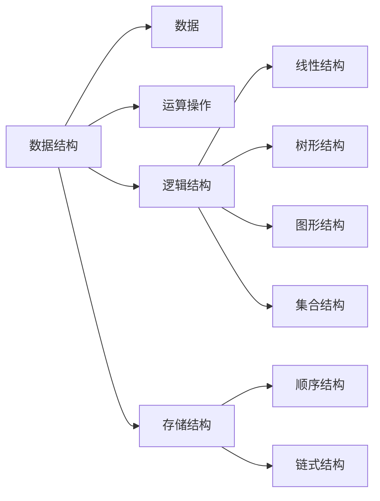

# 数据结构

- 【1】栈 Stack
- 【2】队列 Queue
- 【3】链表 Linked List
- 【4】数组 Array
- 【5】哈希表 Hash Table
- 【6】二叉树 Binary Tree
- 【7】堆 Heap
- 【8】并查集 Union Find
- 【9】字典树 Trie

数据结构是计算机中存储、组织数据的方法。

**程序=数据结构+算法**

数据结构在问题解决中主要用来：【1】**存放要处理的数据**；【2】**实现算法策略**；

数据结构：数据元素D、数据元素之间的逻辑关系L、逻辑关系在计算机中的存储结构S、规定的操作O;

- 逻辑结构：指元素之间客观存在的关系，和数据在计算机中如何存储无关

  - 线性结构：数据元素之间存在一对一的关系；
  - 树形结构：数据元素之间存在一对多的关系；
  - 图形结构：数据元素之间存在多对多的关系；
  - 集合结构：数据元素属于同一个集合；

- 存储结构：逻辑结构主要用于算法设计，而存储结构用于指导算法编程实现。

  - 顺序存储：逻辑上相邻的元素存储在物理位置相邻的存储单元中；

  - 链式存储：在数据元素中添加一些地址域或辅助结构，用于存放数据元素之间的关系；

    顺序存储结构在内存中地址是连续的，所以**存取速度很快**，但**插入、删除**操作效率低。

    链式存储结构在内存地址中可以是不连续的，**插入和删除操作效率高**，但**查找和遍历效率低**。

- 运算操作：数据结构中的操作主要指**数据元素的查找、插入、删除、遍历和排序**等等。

### 【5】哈希表

功能：提供**快速**的**插入、查找**操作；无论哈希表中有多少条数据，插入和查找的时间复杂度均为**O(1)**

缺点：哈希表是基于**数组**的，数组创建后**扩容成本**比较高，当哈希表被填满时，性能下降比较严重。

- 哈希表：键(keys)+值(values);  

- 数组：下标+值；
  - 将keys带入哈希函数得到一个数值作为数组的下标：hash(keys)=下标，然后将键值对（key-value）存入对应下标的数组中。即通过特定key可以对应数组中唯一的下标，在此数组中存着对应的键值对。反之通过value可以得到该value在数组中的下标，通过哈希反计算可以算出key。

哈希表的键若是int类型可直接作为数组的下标，若是非int的键，通过**哈希函数**转化成int后再做数组的下标。

- 哈希函数计算得到的哈希值是一个**非负整数**；
- 若key1=key2，必有hash(key1)=hash(key2);
- 若key1≠key2，必有hash(key1)≠hash(key2);

【Java中的哈希表】

Map是映射、地图的意思，在Java中Map表示一种把K映射到V的数据类型；

HashMap是Java中用哈希数据结构实现的Map;

HashMap的实例有两个影响其性能的参数：**初始容量**和**负载因子(默认为0.75)**；当哈希表中的条目数超过**负载因子×当前容量**时，哈希表将被重载（重建内部数据结构），以便哈希表具有大约两倍的桶数。

- 构造方法：参见【帮助文档】；

- 方法：

  | 变量和类型 | 方法                        | 描述                                                         |
  | ---------- | --------------------------- | ------------------------------------------------------------ |
  | V          | get(Object key)             | 返回指定键映射到的值，如果此映射不包含键的映射，则返回 `null` 。 |
  | V          | put(K key, V value)         | 将指定的值与此映射中的指定键相关联                           |
  | V          | remove(Object key)          | 从此映射中删除指定键的映射（如果存在）。                     |
  | int        | size()                      | 返回此映射中键-值映射的数量                                  |
  | boolean    | containsKey(Object key)     | 如果此映射包含指定键的映射，返回true                         |
  | boolean    | containsValue(Object value) | 如果此映射将一个或多个键映射到指定值，返回true               |

  

# 算法

- 二分搜索 Binary Search
- 分治 Divide Conquer
- 宽度优先搜索 Breadth First Search
- 深度优先搜索 Depth First Search
- 回溯法 Backtracking
- 双指针 Two Pointers
- 动态规划 Dynamic Programming
- 扫描线 Scan-line algorithm
- 快排 Quick Sort

算法用来设计一种使用计算机来解决问题的方法。满足下列性质：

- 输入：有0或多个输入量；

- 输出：产生至少一个输出量；

- 确定性：算法的指令清晰、无歧义；

- 有限性：算法的指令执行次数有限，执行时间有限；

  

在使用计算机解决问题的过程：

- 【1】问题的理解：问题的要求？输入？输出？；
- 【2】数据结构设计：设计能处理问题中数据的数据结构，还要设计能支持算法策略的数据结构；
- 【3】算法设计：选择算法策略，用适当的方式描述和逐步细化算法步骤；
- 【4】算法分析：发现有优化的地方，返回第二步，重新设计数据结构和算法；
- 【5】程序实现：用计算机编程，定义数据结构，编写代码实现；